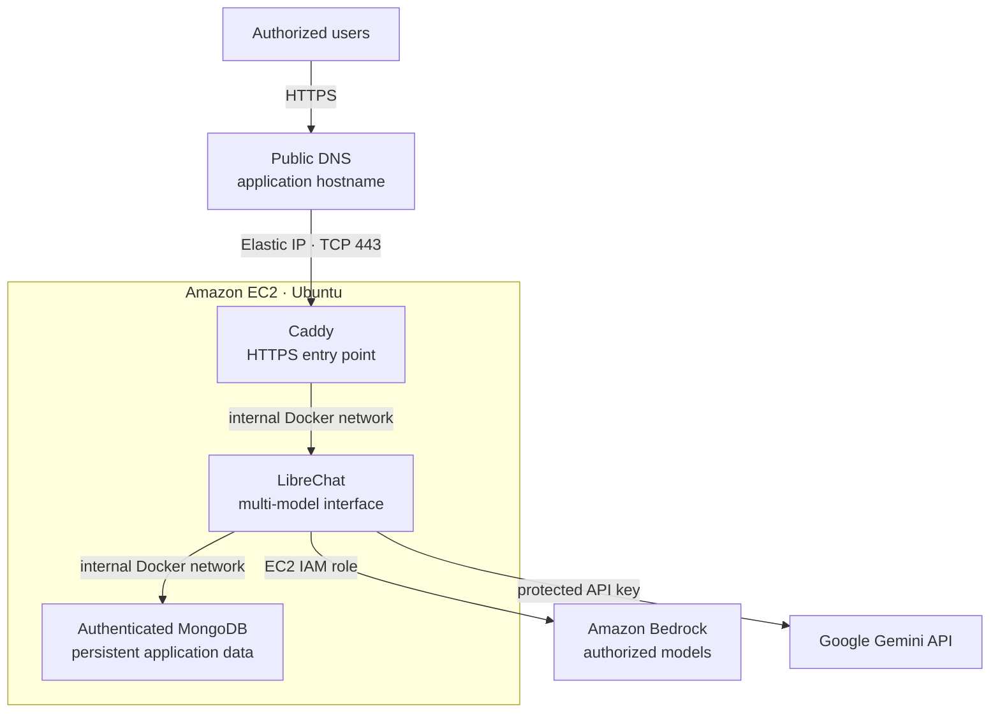
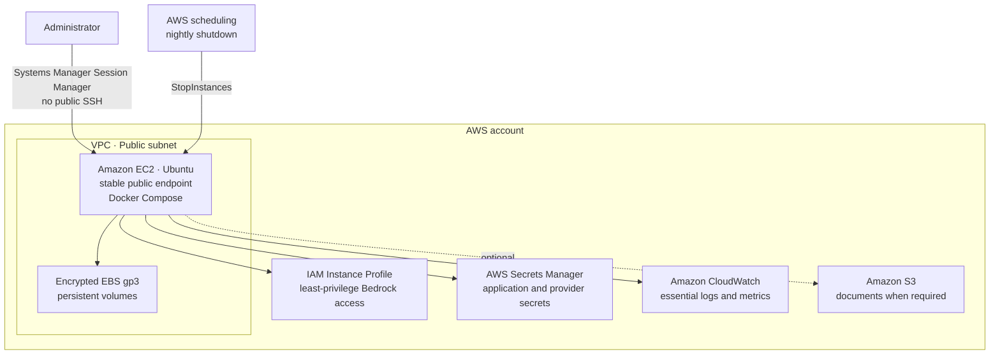

# V0 Architecture

## Runtime and Request Flow

The EC2 Security Group accepts inbound TCP/443 traffic only. Caddy is the only
container exposed publicly; LibreChat and MongoDB remain on the internal Docker
network.

## Infrastructure and Operations

## Security Boundaries

- The Security Group allows inbound TCP/443 traffic only.
- LibreChat and MongoDB ports are never published by Docker.
- Caddy terminates TLS and is the only public application entry point.
- Administration uses AWS Systems Manager Session Manager; port 22 remains closed.
- Amazon Bedrock is accessed through the EC2 IAM role without static AWS credentials.
- Application secrets are stored in AWS Secrets Manager and injected at runtime.
- Persistent data is stored on encrypted EBS volumes and protected with snapshots.

## Lifecycle

- The instance is started manually.
- A scheduled action stops it every night.
- No automatic morning startup is configured in V0.
- This strategy must be reassessed if agents or asynchronous workloads need to
  operate outside interactive usage periods.
